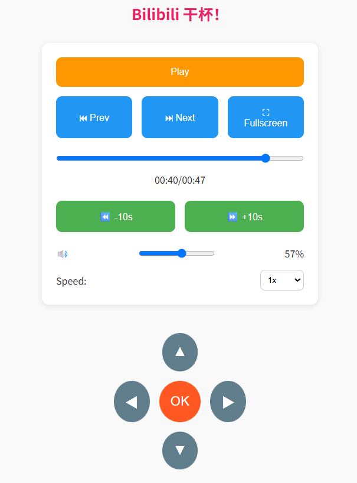

# Bilibili 遥控器

> 电视机接上电脑，打开 B 站，躺在沙发，想视频快进？你需要 "Bilibili 遥控器"



## Step

1. install chrome_extension in Chrome/Edge

```
chrome://extesions => "Developer mode" => "Load unpacked" => select the folder of chrome_extension/
```

2. run python_server in your computer

```
docker-compose up --build
```

3. Firewall, allow port 5000

```
Press Win key
=> "Windows Defender Firewall with Advanced Security"
=> "Inbound Rules"
=> "New Rule"
=> "Port", "5000", "Allow the connection", "Private" Only!!!, "next" * N
```

4. Try in your phone!

* first, your computer ip => `ipconfig`, e.g. 192.168.1.2
* Phone, visit "http://<your computer ip>:5000", e.g. "http://192.168.1.2:5000"
